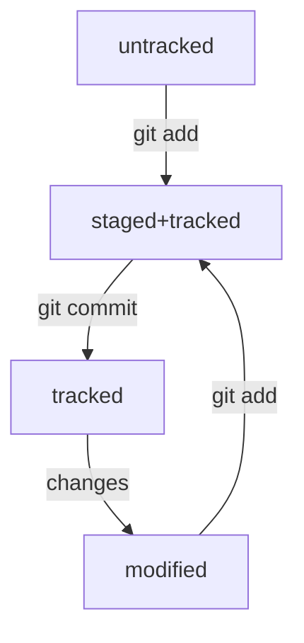

# Знакомство с GitHub  

**GitHub** — платформа, которая работает с Git и упрощает командное взаимодействие.  

**Git** — это консольный инструмент для работы с локальными и удалёнными репозиториями. Он не связан напрямую ни с одной из платформ и развивается отдельно от них.  

# Создание репозитория  

1. Перейдите на вкладку *Repositories*, а затем нажмите на зелёную кнопку *New* справа.  
2. Открылось окно создания нового репозитория. Назовите его *MR*.  
3. Нажимайте на зелёную кнопку *Create repository* внизу.  

# Связываем локальный и удаленный репозитории  

1. Перейдите на страницу удалённого репозитория, выберите тип SSH и скопируйте URL.  
2. Откройте консоль, перейдите в каталог локального репозитория и введите команду **git remote add**.  
   Команде необходимо передать два параметра: имя удалённого репозитория и его URL. В качестве имени используйте слово *origin*.  
3. Убедитесь, что репозитории связаны с помощью команды **git remote -v**.  

# Хеширование коммитов  

**Хеширование** — это способ преобразовать набор данных и получить их «отпечаток».  

**Информация о коммите** — это набор данных: когда был сделан коммит, содержимое файлов в репозитории на момент коммита и ссылка на предыдущий, или *родительский*, коммит.  

Git преобразует информацию о коммитах с помощью алгоритма **SHA-1** и для каждого из них рассчитывает уникальный идентификатор — *хеш*.  

Все хеши, а также таблицу соответствий хеш → информация о коммите Git хранит в папке **.git.**  

# Элементы описания коммита  

Элементы, из которых состоит описание:  

* строка из цифр и латинских букв после слова commit — это *хеш коммита*;  

* _Author_ — имя автора и его электронная почта;  

* _Date_ — дата и время создания коммита;  

* в конце находится сообщение коммита.  

Вызвать лог можно командой **git log**.  

Вызвать сокращенный лог можно командой **git log --oneline**. В сокращённом логе выводятся сокращённые хеши — их можно использовать точно так же, как и полные. 

# Файл HEAD  

Файл **HEAD** — один из служебных файлов папки *.git*. Он указывает на коммит, который сделан последним (то есть на самый **новый**).  

Внутри **HEAD** — ссылка на служебный файл: *refs/heads/master* (или *refs/heads/main* в зависимости от названия ветки). Если заглянуть в этот файл, можно увидеть хеш последнего коммита.  

Вместо хеша последнего коммита можно написать слово **HEAD**.  

# Статусы файлов в Git  

## Статусы untracked/tracked, staged и modified  

1. **untracked** - у untracked-файла нет предыдущих версий, зафиксированных в коммитах или через команду *git add*.  

2. **staged** - после выполнения команды *git add* файл попадает в *staging area*, то есть в список файлов, которые войдут в коммит. В этот момент файл находится в состоянии staged.  

3. **tracked** - состояние tracked — это противоположность untracked. То есть все файлы, в которых Git так или иначе отслеживает изменения.  

4. **modified** - состояние modified означает, что Git сравнил содержимое файла с последней сохранённой версией и нашёл отличия.  

## Жизненный цикл файла в Git  

# Команда git status  

Команда **git status** всегда подскажет, что происходит с файлом: например, он добавлен в список «на коммит» или ещё вообще не отслеживается, или изменён.  

**git status** показывает явно следующие состояния файлов: *untracked*, *staged* и *modified*.  

**git status** подсказывает, какие команды можно выполнить, чтобы поменять состояние файла.